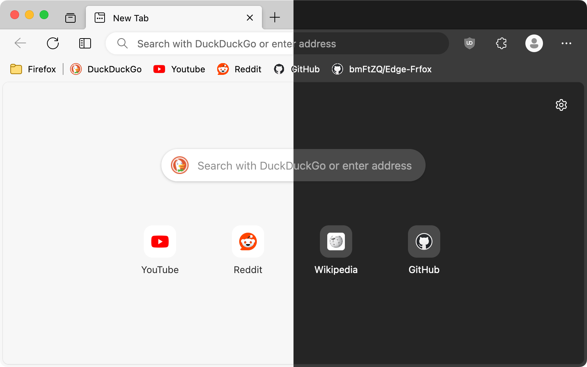
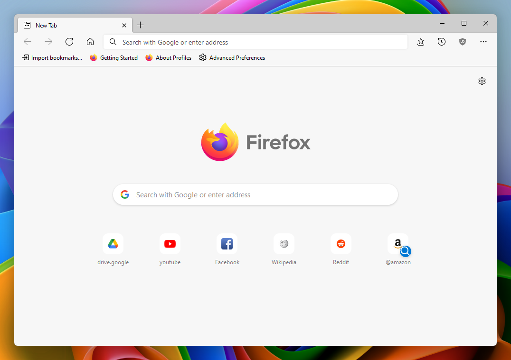
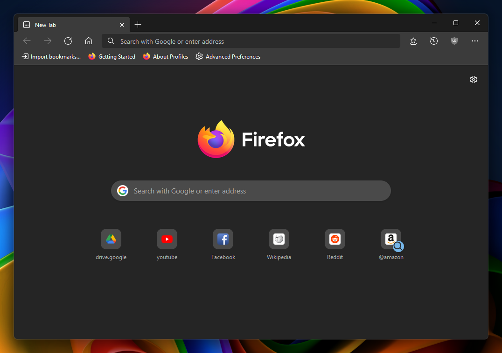
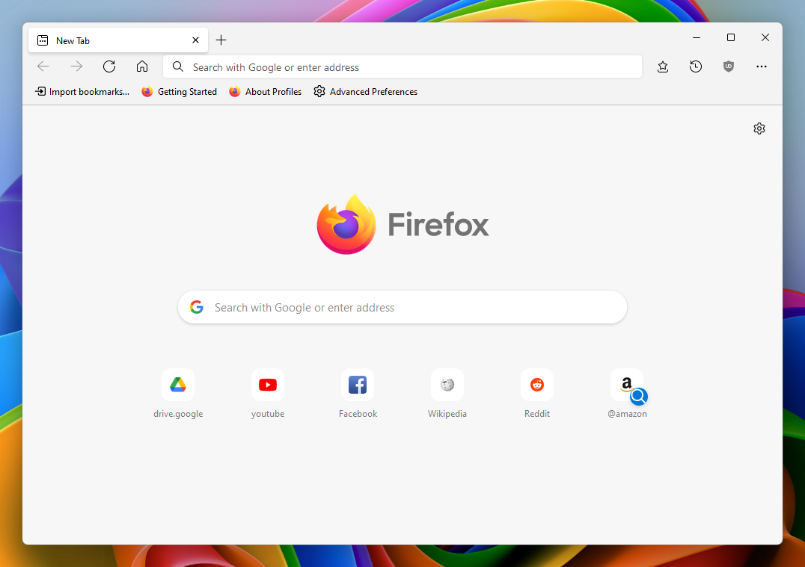
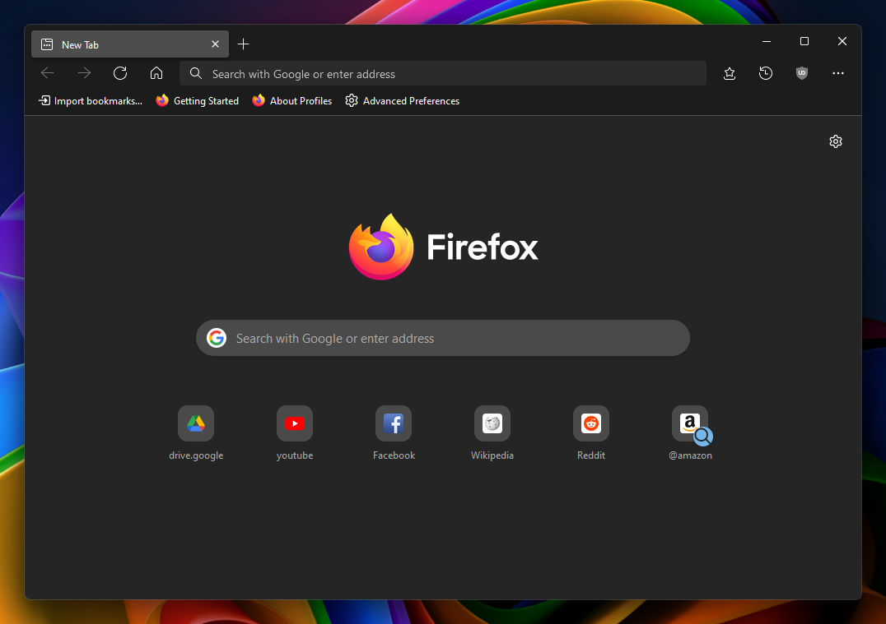
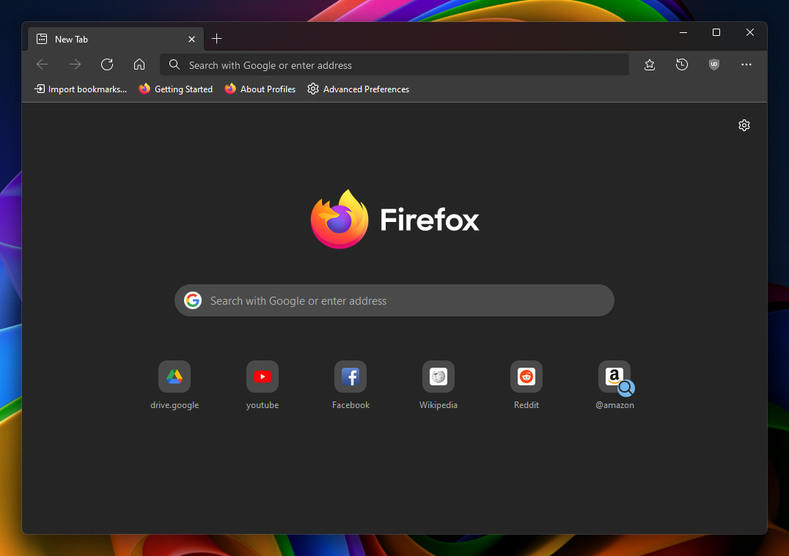
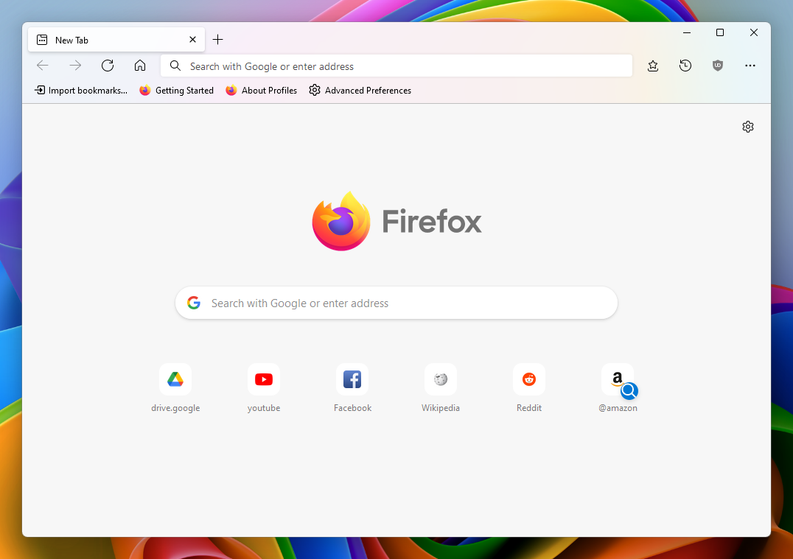
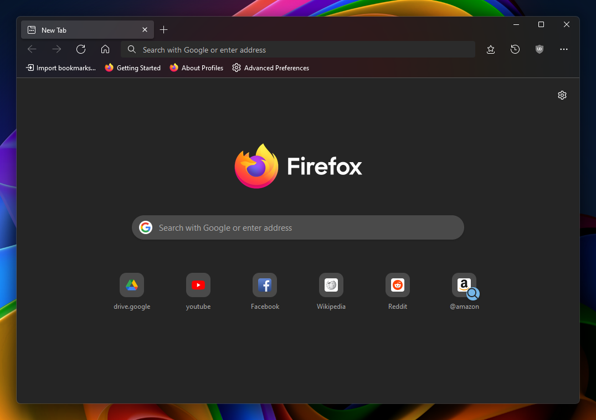
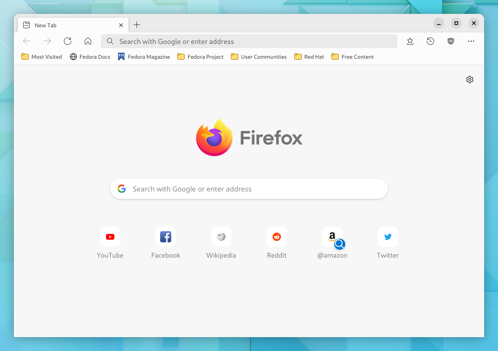
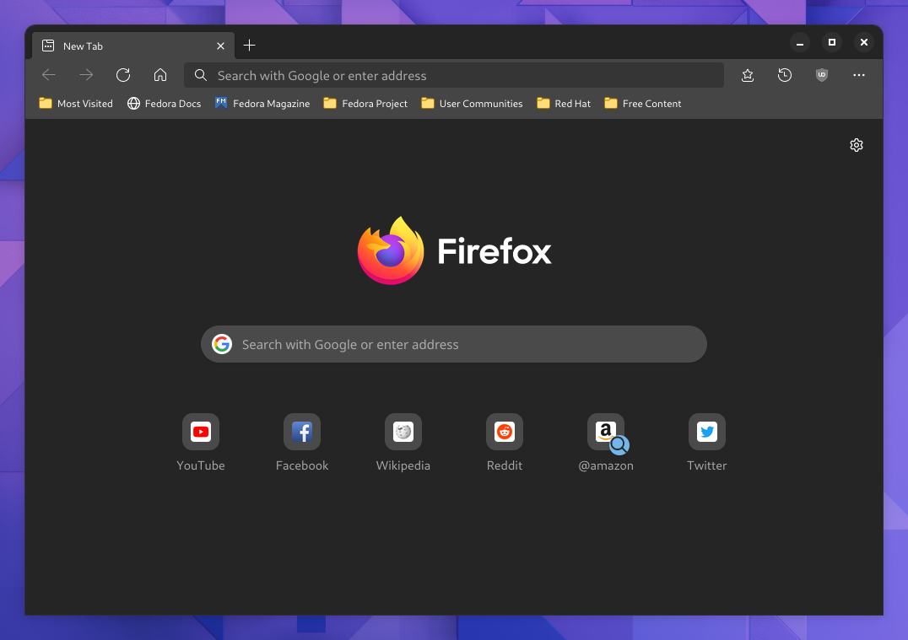

# Edge-Frfox
A Firefox userChrome.css theme that aims to recreate the look and feel of the Chromium version of Microsoft Edge.

###### Screenshot taken with macOS Monterey / Firefox Nightly 96.0a1 (2021-11-30)

## How to install
1. Go to `about:support` and click the "Open Folder/Show in Finder" button for the root directory of your browser profile/s.
2. Download and copy the `chrome` folder into the profile folder.
3. Go to about:config and change these preferences:
   ###### For all operating systems:
   1. `toolkit.legacyUserProfileCustomizations.stylesheets` = `true`
   2. `svg.context-properties.content.enabled` = `true`
   3. `layout.css.color-mix.enabled` = `true`

   ###### On macOS:
   1. To use the Edge style context menu on macOS then set `widget.macos.native-context-menus` = `false`

   ##### Recommended:
   1. `browser.tabs.tabMinWidth` = `66`
   2. `browser.tabs.tabClipWidth` = `66`

   Additional tweaks can also be applied to the theme, such as Mica (Windows 11 Only), Floating Tabs and more. See [Tweaks](#tweaks).

**Note: Most frequently tested on macOS**

## Screenshots
|Theme|Light|Dark|
|-|-|-|
|Default (Windows 11)|||
|Floating Tabs (Windows 11)|||
|Mica (Windows 11)|||
|Mica and Floating Tabs (Windows 11)|||
|GTK (GNOME 42, [adw-gtk3](https://github.com/lassekongo83/adw-gtk3) theme)|||

## Tweaks
Certain tweaks can be applied to the theme, to enable them navigate to `about:config` and create a boolean key for each tweak you want to use and set it to `true`, then restart the browser.

To disable a tweak, set the key to `false` or delete it, then restart the browser.

|disable drag space above tabs|
|-|
|`uc.tweak.disable-drag-space`|

|enable Edge style floating tabs|
|-|
|`uc.tweak.floating-tabs`|

|enable Mica toolbar background (Windows 11 only)|
|-|
|**See [Mica Tweak Instructions (Windows 11 Only)](#mica-tweak-instructions-windows-11-only) for installation instructions.**|
|**NOTE: Only works on default theme: 'System theme - auto'**|
|`uc.tweak.win11-mica`|

|force tab background colour to the same colour as the navbar background (useful for Proton themes)|
|-|
|**NOTE: can cause readability issues with some themes! (eg. white text on white bg)**|
|`uc.tweak.force-tab-colour`|
| (Left: OFF, Right: ON)|

|only show Firefox account button when in private mode (useful as a private browsing indicator)|
|-|
|**NOTE: all functionality of this button can still be accessed from the app menu.**|
|`uc.tweak.fxa-button-as-private-indicator`|

|remove tab separators|
|-|
|`uc.tweak.remove-tab-separators`|

|remove extra padding from permissions button (older functionality)|
|-|
|`uc.tweak.less-permissions-button-padding`|

## Mica Tweak Instructions (Windows 11 Only)
1. Download and install [Mica For Everyone](https://github.com/MicaForEveryone/MicaForEveryone).
2. Create a custom process rule with the following:
   1. Name: `firefox`
   2. Titlebar Color: `System`
   3. Backdrop Type: `Mica`
3. Enable tweak in `about:config`: `uc.tweak.win11-mica`
4. Restart Firefox.

## Acknowledgements
[muckSponge](https://github.com/muckSponge) - [MaterialFox](https://github.com/muckSponge/MaterialFox)

[Microsoft](https://github.com/microsoft) - [Fluent UI System Icons](https://github.com/microsoft/fluentui-system-icons)

[KibSquib48](https://github.com/KibSquib48) - [MicaFox](https://github.com/KibSquib48/MicaFox)

---

Old version can be found [here](https://github.com/bmFtZQ/edge-frfox/tree/v91.0-archive).
