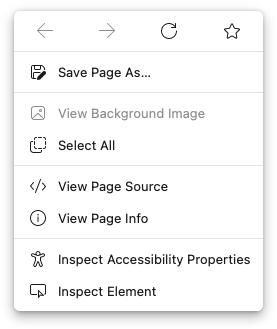

# Edge-FrFox
A userChrome.css theme for Firefox that replicates Microsoft Edge.

## Screenshots

#### Lightmode

#### Darkmode

#### Right Click Menus

## How to install

1. Go to about:support and click the button that shows your profile folder in your file explorer.
2. Copy the `chrome` folder into the profile folder
3. Go to about:config and enter the following values:
   1. `toolkit.legacyUserProfileCustomizations.stylesheets` = `true`
   2. `svg.context-properties.content.enabled` = `true`
   ###### Recommeneded settings:
   1. `browser.tabs.tabClipWidth` = `83`
   2. `security.insecure_connection_text.enabled` = `true`

**Note: Only tested on macOS Big Sur with Firefox Release 86**

## Acknowledgements
[muckSponge](https://github.com/muckSponge) - [MaterialFox](https://github.com/muckSponge/MaterialFox)

[Microsoft](https://github.com/microsoft) - [Fluent System Icons](https://github.com/microsoft/fluentui-system-icons)
