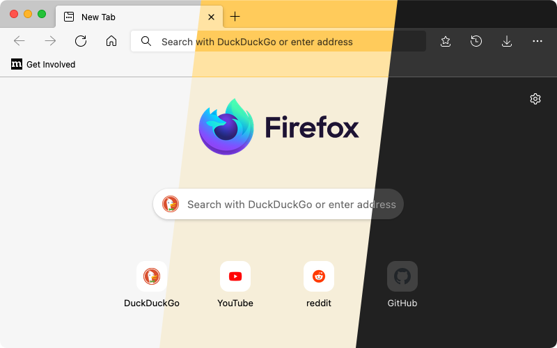

# Edge-FrFox rewrite
A Firefox userChrome.css theme that aims to recreate the look and feel of the Chromium version of Microsoft Edge.

This branch is for a new version that is rewritten from scratch. Old version can be found in the [`main`](https://github.com/bmFtZQ/Edge-FrFox/tree/main) branch.

#### This version of the theme has only been test on Firefox Nightly 96 but should work on Firefox 94.

###### Screenshot taken with macOS Monterey / Firefox Nightly 96.0a1 (2021-11-30)

## How to install
1. Go to `about:support` and click the "Show in File Explorer/Finder" button for the root directory of your browser profile/s.
2. Download and copy the `chrome` folder into the profile folder.
3. Go to about:config and change these preferences:
   ###### For all operating systems:
   1. `toolkit.legacyUserProfileCustomizations.stylesheets` = `true`
   2. `svg.context-properties.content.enabled` = `true`
   3. `layout.css.color-mix.enabled` = `true`

   ###### On macOS:
   1. To use the Edge style context menu on macOS then set `widget.macos.native-context-menus` = `false` **(Not Implemented Yet!)**
   
**Note: Most frequently tested on macOS**

## Acknowledgements
[muckSponge](https://github.com/muckSponge) - [MaterialFox](https://github.com/muckSponge/MaterialFox)

[Microsoft](https://github.com/microsoft) - [Fluent UI System Icons](https://github.com/microsoft/fluentui-system-icons)
