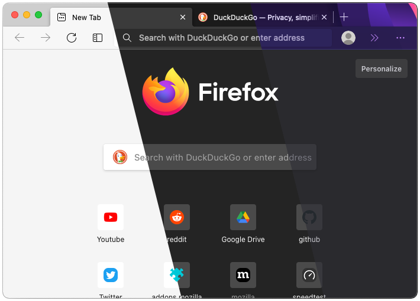
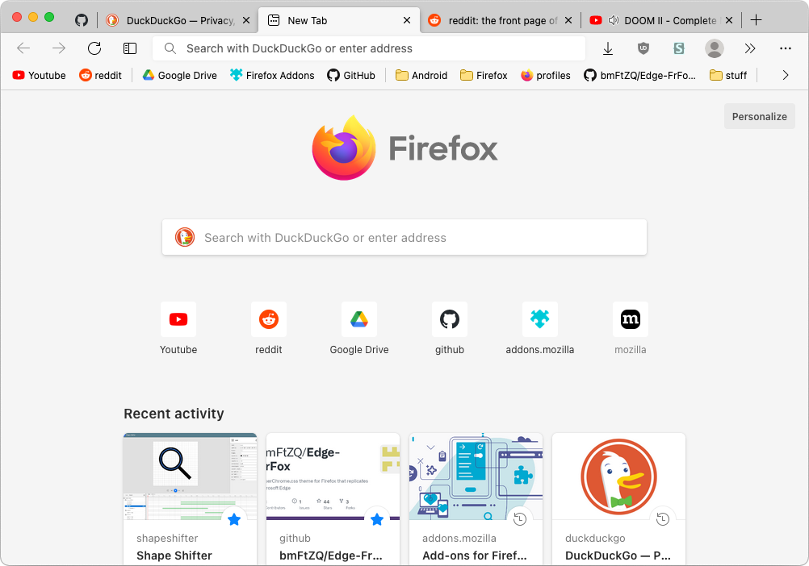
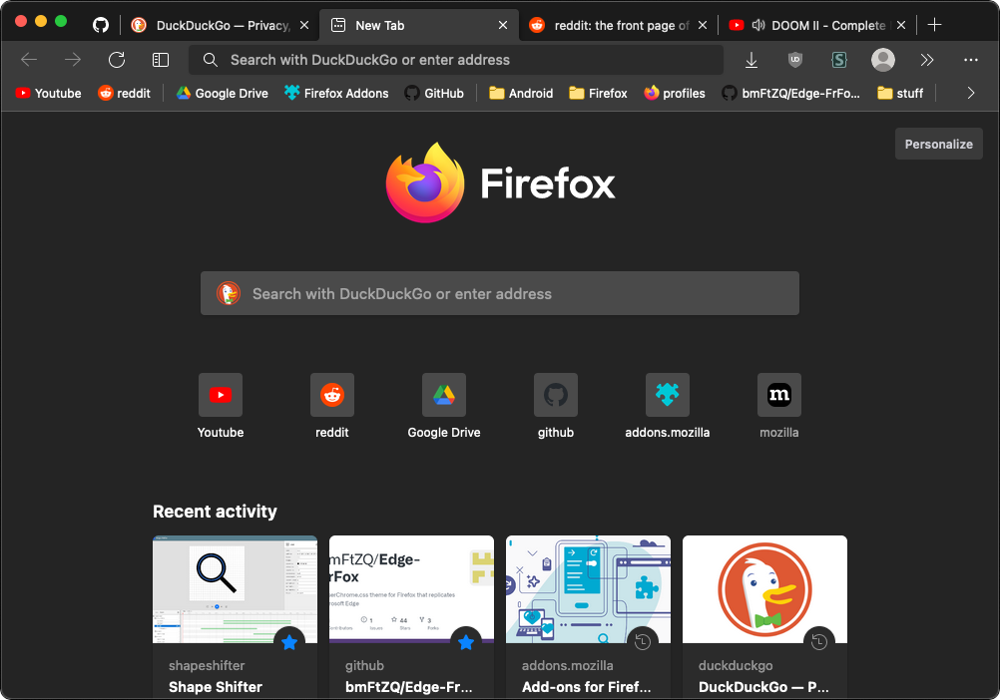
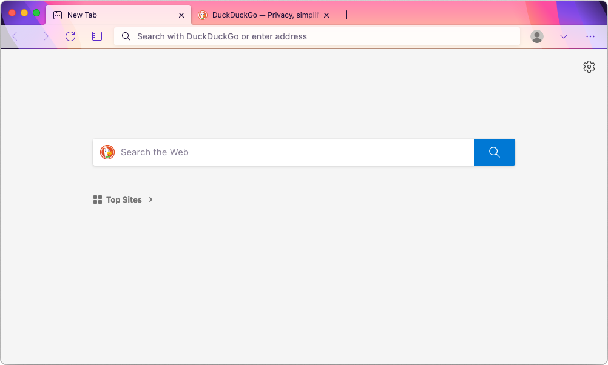
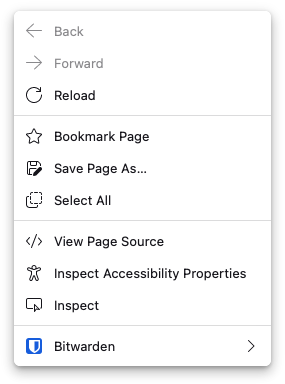
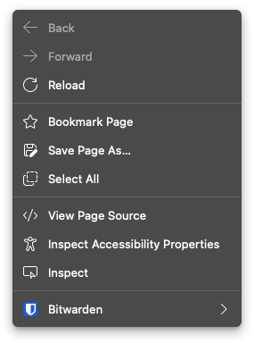
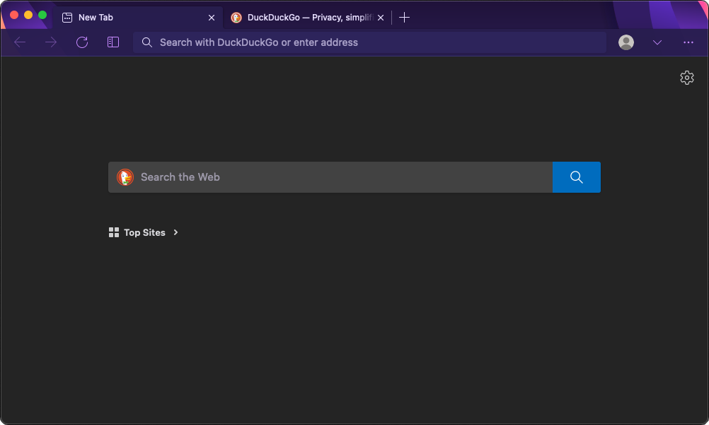

# Edge-FrFox
A userChrome.css theme for Firefox that replicates Microsoft Edge and adds icons to the right click menus.

## Screenshots
Newtab Page Light|Newtab Page Dark|Firefox Alpenglow Light
-|-|-
 |  | 
Right Click Menu Light | Right Click Menu Dark | Firefox Alpenglow Dark
 |  | 

## How to install

1. Go to about:support and click the button that shows your profile folder in your file explorer.
2. Copy the `chrome` folder into the profile folder
3. Go to about:config and enter the following values:
   1. `toolkit.legacyUserProfileCustomizations.stylesheets` = `true`
   2. `svg.context-properties.content.enabled` = `true`
   ###### Recommended settings:
   1. `browser.tabs.tabClipWidth` = `83`
   2. `security.insecure_connection_text.enabled` = `true`

** Note: Only properly tested on macOS 11 Big Sur

## Acknowledgements
[muckSponge](https://github.com/muckSponge) - [MaterialFox](https://github.com/muckSponge/MaterialFox)

[Microsoft](https://github.com/microsoft) - [Fluent UI System Icons](https://github.com/microsoft/fluentui-system-icons)
